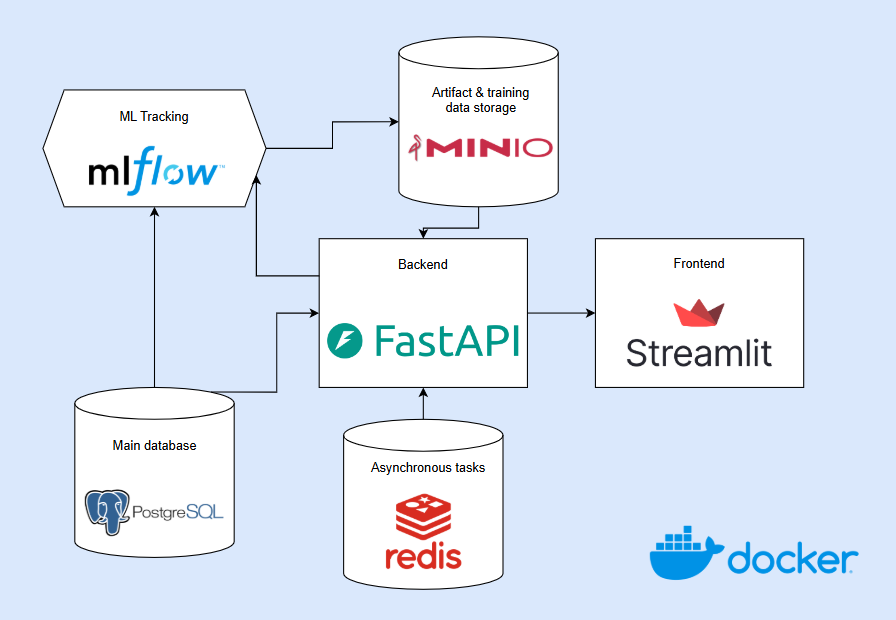

# Actor-based sentiment analysis in press news articles

## System design


## Quickstart
1. Install docker
2. In folder `docker/backend` copy `.env.example` into `.env` and fill the required environmental variables if necessary. Do similar process for `docker/frontend`.
3. From the root directory run 
```bash
docker-compose up
```
This command will start the application and all the required services. Frontend application will be accessible at `localhost:8501` and backend at `localhost:8000`.

4. Database backup:

Dump:
```
docker exec -t postgres pg_dump -U postgres postgres > backups/backup.sql
```
Restore:
```
docker exec -i postgres psql -U postgres -d your_database_name < backups/backup.sql
```
5. Database migrations:
```
alembic revision --autogenerate -m "your_migration_message"
alembic upgrade head
```
6. Create requirements.txt (lockfile with all dependencies)
```bash
pip-compile -v --resolver=backtracking requirements.in --output-file requirements.txt
```